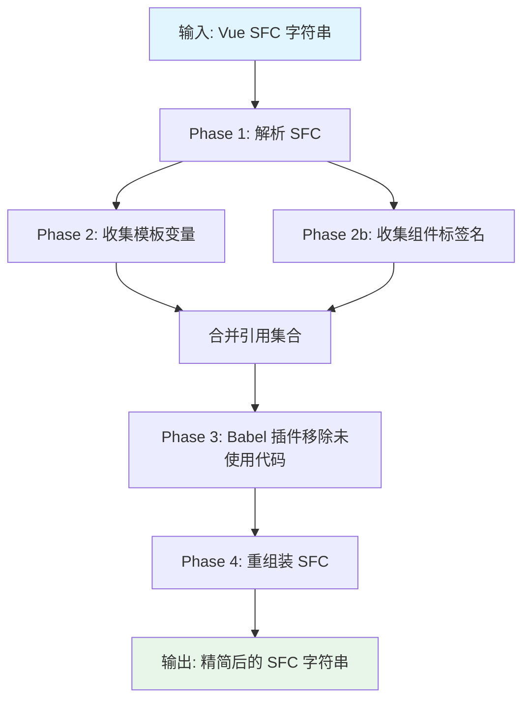
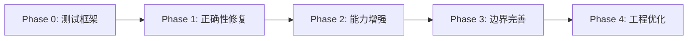

# vue3-tree-shaking 优化实施计划

> 创建时间: 2026-03-10
> 状态: 待确认

## 背景

该包用于低代码平台生成的 Vue 3 SFC 代码的 tree-shaking，移除 `<script setup>` 中模板未引用的代码。当前实现存在多个正确性问题和工程短板，需要系统性优化。

## 整体架构



## 实施步骤

### Phase 0: 基础设施 — 测试框架搭建

- [ ] **0.1** 安装 vitest 作为 devDependency
- [ ] **0.2** 在 `package.json` 中添加 `"test": "vitest run"` 脚本
- [ ] **0.3** 创建 `tests/` 目录，编写基础测试用例覆盖当前行为
  - 基本 import 移除（命名导入、默认导入）
  - 变量声明移除
  - 函数声明移除
  - 解构模式移除
  - v-for / v-if / 插值表达式中的变量保留
- [ ] **0.4** 为后续每个 Phase 的修复预先编写失败测试用例（TDD）

### Phase 1: P0 — 正确性修复

- [ ] **1.1 修复副作用函数误删**
  - 修改 `babelPluginShakeVueScript.js` 的 `CallExpression` visitor
  - 策略：**反转逻辑** — 不再删除"未使用的函数调用"，而是只删除明确安全的声明。顶层函数调用（如 `onMounted(...)`, `watch(...)`, `useXxx()`）默认保留
  - 只有当调用结果被赋值给一个未使用的变量时，才考虑删除（由 `VariableDeclarator` 处理）
  - 移除当前 `CallExpression` visitor 或改为仅处理赋值场景

- [ ] **1.2 保留模板中使用的组件 import**
  - 修改 `variable_collector.ts`，在 `ELEMENT` 节点处理中收集组件标签名
  - Vue 3 `<script setup>` 中组件是直接 import 使用的，需要将 PascalCase 和 kebab-case 标签名都映射回 import 名
  - 例如：`<MyComponent />` → 保留 `import MyComponent`；`<my-component />` → 保留 `import MyComponent`
  - 判断逻辑：非原生 HTML 标签的 ELEMENT 节点视为组件

- [ ] **1.3 保留编译器宏**
  - 在 Babel 插件中添加白名单：`defineProps`, `defineEmits`, `defineExpose`, `defineOptions`, `defineSlots`, `defineModel`, `withDefaults`
  - 这些标识符出现在 `CallExpression` 中时，无条件保留整个语句

- [ ] **1.4 支持 ImportDefaultSpecifier 和 ImportNamespaceSpecifier**
  - 在 Babel 插件中添加 `ImportDefaultSpecifier` 和 `ImportNamespaceSpecifier` visitor
  - 逻辑与 `ImportSpecifier` 一致：检查 binding 和 referencedIdentifiers

### Phase 2: P1 — 能力增强

- [ ] **2.1 支持 TypeScript (`<script setup lang="ts">`)**
  - 在 `removeUnusedVars` 中检测 `scriptSetup.lang`
  - 当 lang 为 ts/tsx 时，给 `@babel/standalone` 的 transform 添加 `@babel/plugin-transform-typescript` 预设
  - `@babel/standalone` 内置了 TS 插件，只需在 presets 中指定 `["typescript", { onlyRemoveTypeImports: false }]`

- [ ] **2.2 精简 dependencies**
  - 移除未使用的包：`@babel/generator`, `@babel/parser`, `@babel/traverse`, `@babel/types`, `@babel/preset-env`, `less`
  - 保留：`@babel/core`（Node.js 端）、`@babel/standalone`（浏览器端）、`@vue/compiler-sfc`、`@vue/compiler-core`、`acorn`、`acorn-walk`
  - 考虑将 `@babel/standalone` 改为 peerDependency 或提供双入口（Node 用 `@babel/core`，浏览器用 `@babel/standalone`）

- [ ] **2.3 完善 SFC 重组装**
  - 重写 `index.ts` 中的 SFC 拼接逻辑
  - 使用 `descriptor` 的完整信息重建：
    - 保留 `<template>` 上的 `lang` 等属性
    - 保留 `<script setup>` 上的所有原始属性
    - 保留 `<style>` 的完整属性
    - 保留自定义块（`descriptor.customBlocks`）
  - 封装为独立函数 `reconstructSFC(descriptor, newScriptContent)`

- [ ] **2.4 双环境入口**
  - vite.config.ts 配置两个构建入口：
    - `lib/index.ts` — Node.js 入口，使用 `@babel/core`
    - `lib/index.browser.ts` — 浏览器入口，使用 `@babel/standalone`
  - 或者：运行时检测环境，动态选择 babel 实现（更简单但不利于 tree-shaking）
  - package.json exports 中区分 `"node"` 和 `"browser"` 条件

### Phase 3: P2 — 边界情况完善

- [ ] **3.1 完善 v-for 局部变量**
  - `variable_collector.ts:57` 补充 `index` 字段处理
  - `forParseResult` 结构：`{ source, value, key, index }`，当前缺少 `index`

- [ ] **3.2 完善 v-slot 作用域变量**
  - 在 `ELEMENT` 节点处理中，检查 `v-slot` 指令
  - `v-slot` 的参数（如 `v-slot="{ item, index }"`）应加入 `localScopeIdentifier`
  - 需要解析 slot 参数的解构模式，提取所有标识符

- [ ] **3.3 改进错误处理**
  - `parseExpression` 中 acorn 解析失败时，返回空结果而非 console.log
  - `treeShakeVueSFC` 主函数添加 try-catch，返回结构化错误信息
  - 定义错误类型：`TreeShakeError { message, phase, detail }`

### Phase 4: 工程优化

- [ ] **4.1 清理遗留代码**
  - 删除 `index.d.ts`（`setupCounter` 与项目无关，是 Vite 模板残留）
  - 清理 `variable_collector.ts` 中注释掉的 NodeTypes 枚举

- [ ] **4.2 将 Babel 插件改为 TypeScript**
  - `babelPluginShakeVueScript.js` → `babelPluginShakeVueScript.ts`
  - 添加类型标注，提升可维护性

- [ ] **4.3 完善 package.json**
  - 添加 `license` 字段
  - 添加 `repository` 字段
  - 更新 `keywords`：`["vue3", "tree-shaking", "sfc", "dead-code-elimination", "script-setup"]`
  - 版本号升级策略：P0 修复后发 1.1.0，P1 完成后发 2.0.0（有 breaking change：依赖变化）

- [ ] **4.4 更新 README**
  - 补充 API 文档、支持的场景、限制说明

## 依赖变更总览

```
移除:
  @babel/generator, @babel/parser, @babel/traverse, @babel/types, @babel/preset-env, less

保留:
  @babel/core, @babel/standalone, @vue/compiler-sfc, @vue/compiler-core, acorn, acorn-walk

新增 (devDependencies):
  vitest
```

## 风险评估

| 风险 | 影响 | 缓解措施 |
|------|------|----------|
| 副作用函数判断不准确 | 可能保留过多或误删 | 采用保守策略（宁可多保留），配合测试覆盖 |
| 组件名 kebab-case 映射 | 可能漏匹配 | 使用 Vue 官方的 `camelize`/`capitalize` 工具函数 |
| `@babel/standalone` TS 支持 | 浏览器端 TS 解析可能有边界问题 | 测试覆盖常见 TS 语法 |
| 双入口构建复杂度 | 维护成本增加 | 抽取共享逻辑到独立模块 |

## 执行顺序



Phase 0 和 Phase 1 为最高优先级，建议先完成这两个阶段后发布 patch 版本修复关键 bug，再推进后续阶段。
